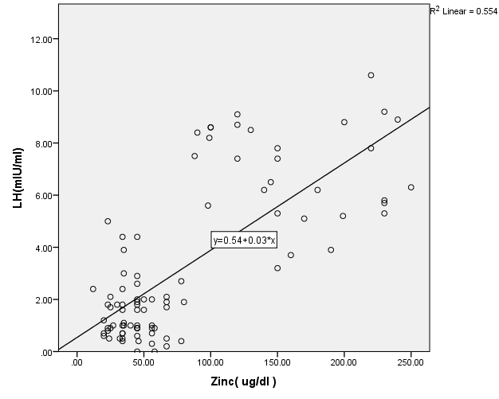
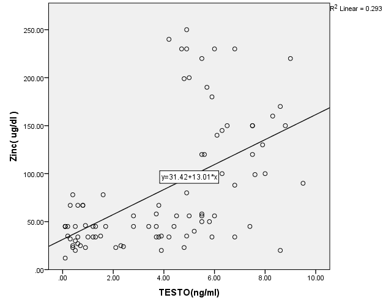
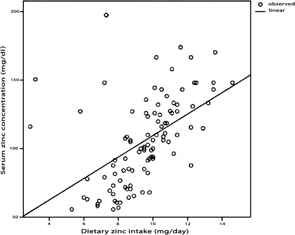
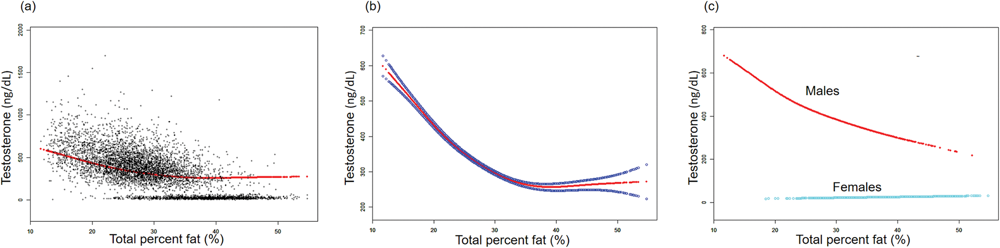

A small overview of factors having been found to be significant determinants of total or free T in men

## Metabolic Pathway

## Age

[Validated Age-Related Normative Model for Male Total Testosterone Shows Increasing Variance but No Decline after Age 40 Years](https://pmc.ncbi.nlm.nih.gov/articles/PMC4190174/) shows the following graph. Unlike others, they don't necessessarily find an age-related decline, rather an increased variance with age

|||
|---|---|
| |  |

## Exercice

## Nutrition

### Zinc

[Effect of some toxic metals in drinking water on male reproductive hormones](https://www.researchgate.net/publication/357216771_Effect_of_some_toxic_metals_in_drinking_water_on_male_reproductive_hormones) and [Association of Mood Disorders with Serum Zinc Concentrations in Adolescent Female Students](https://www.researchgate.net/publication/312146397_Association_of_Mood_Disorders_with_Serum_Zinc_Concentrations_in_Adolescent_Female_Students) produce the following graphs

  
   
  

### Boron

[Comparative effects of daily and weekly boron supplementation on plasma
steroid hormones and proinflammatory cytokines](https://pubmed.ncbi.nlm.nih.gov/21129941/)on non-smokers with a mean age of 41.3 ± 7.5 (range 29–50) years and body mass index (BMI) of 25.5 ± 2.2 kg/m2

However, [The Effect of Boron Supplementation on Lean Body Mass, Plasma Testosterone Levels, and Strength in Male Bodybuilders](https://journals.humankinetics.com/view/journals/ijsnem/3/2/article-p140.xml) find no effect

### Added Sugar

https://www.youtube.com/watch?v=E9zLBarWDCI

## Bodyfat

[Percent body fat was negatively correlated with Testosterone levels in male](https://journals.plos.org/plosone/article?id=10.1371/journal.pone.0294567) from 5959 participants from the NHANES 2011–2016

[Weight Loss in Amateur Wrestlers and Its Effect on Serum Testosterone Levels](https://pmc.ncbi.nlm.nih.gov/articles/PMC4446567/)

## Fasting

## Social context

[Testosterone eliminates strategic prosocial behavior through impacting choice consistency in healthy males](https://pubmed.ncbi.nlm.nih.gov/37012404)

## Sleep

[Sleep Duration and Disturbances Were Associated With Testosterone Level, Muscle Mass, and Muscle Strength—A Cross-Sectional Study in 1274 Older Men](https://www.sciencedirect.com/science/article/abs/pii/S1525861015002947)

[Effect of partial and total sleep deprivation on serum testosterone in healthy males: a systematic review and meta-analysis](https://pubmed.ncbi.nlm.nih.gov/34801825/)

[Effect of 1 Week of Sleep Restriction on Testosterone Levels in Young Healthy Men](https://pmc.ncbi.nlm.nih.gov/articles/PMC4445839/)

## Stress

## Alcohol

[Relationship between Alcohol Consumption and Testosterone Deficiency according to Facial Flushes among Middle-Aged and Older Korean Men](https://pmc.ncbi.nlm.nih.gov/articles/PMC9708857/)

## Toxins