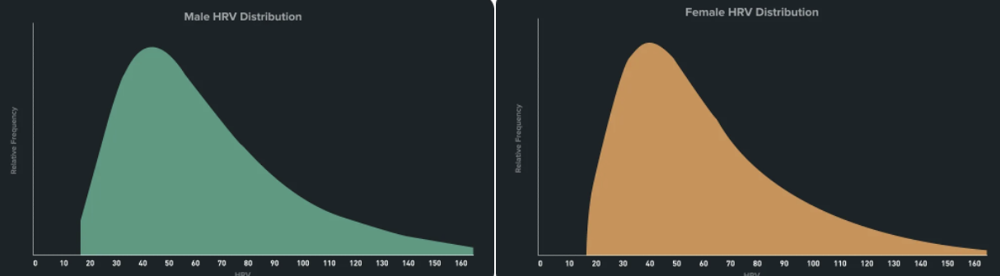
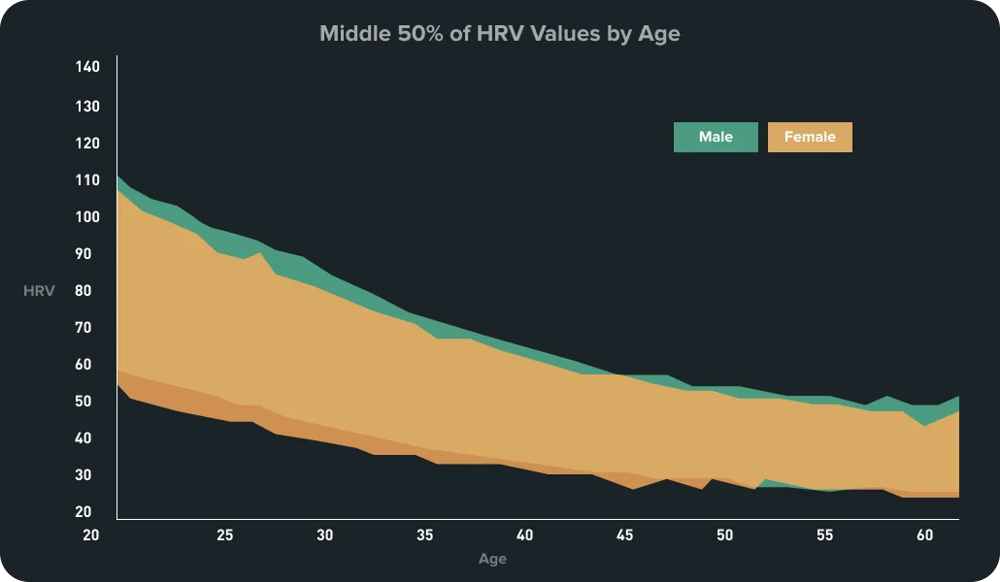

## Calculation

|Parameter|Unit|Formula|Description|
|---|---|---|---|
|MeanRRi|ms|$\frac{\sum_{i=1}^{N} RR_i}{N}$|Mean variability of interbeat interval|
|**RMSSD**|ms|$\sqrt{\frac{\sum_{i=1}^{N-1} (RR_{i+1} - RR_i)^2}{N-1}}$|Reflects parasympathetic activity|
|pNN5|%|$\frac{\text{Count}((RR_{i+1} - RR_i) > 5ms)}{N-1} \times 100$|Reflects parasympathetic activity|

Wearables typically use to RMSSD definition 

## Whoop

## Age

## Fitness

## Gender

## Sleep quality

## Stress

## Caffeine

## Cold exposure