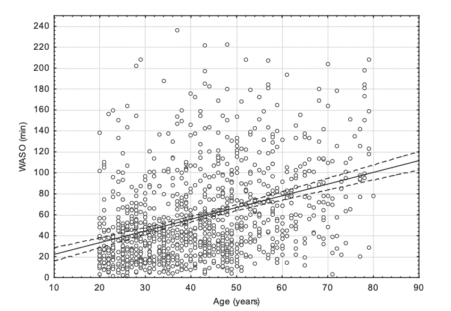
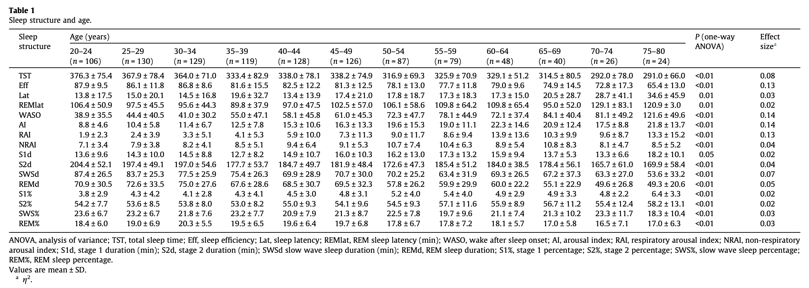
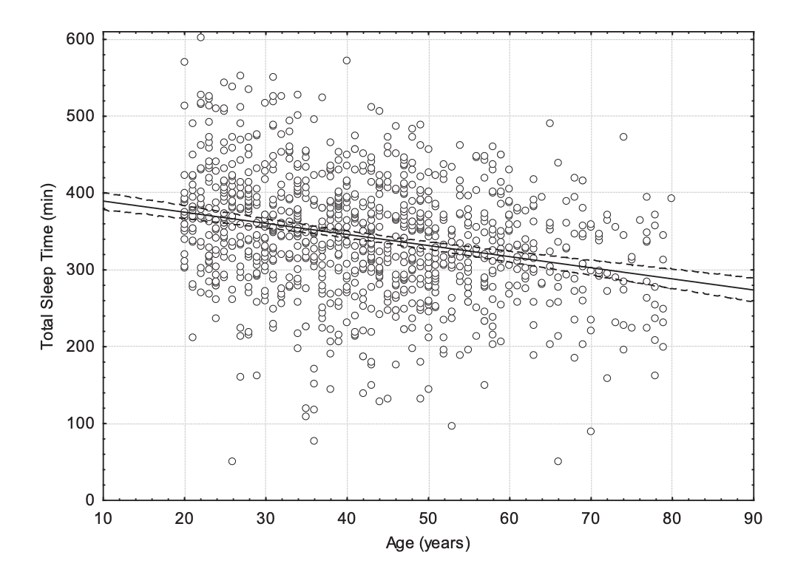
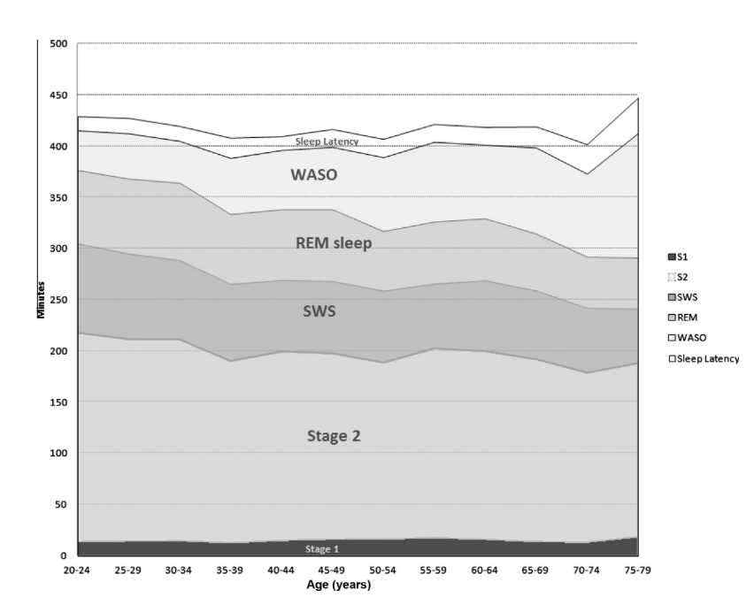

## Age

[Effects of aging on sleep structure throughout adulthood: a population-based study](https://pubmed.ncbi.nlm.nih.gov/24657204/) comprising of 1024 individuals who were submitted to polysomnography and structured interviews and subdivided
our sample into five-year age groups

## Fitbit charge 3
[Performance of Fitbit Charge 3 against polysomnography in measuring sleep in adolescent boys and girls](https://www.tandfonline.com/doi/full/10.1080/07420528.2021.1903481)

