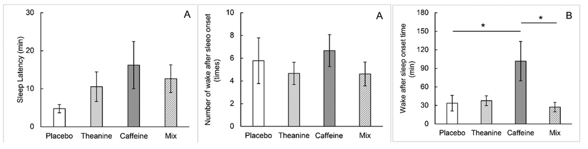

## Age

[Effects of aging on sleep structure throughout adulthood: a population-based study](https://pubmed.ncbi.nlm.nih.gov/24657204/) comprising of 1024 individuals who were submitted to polysomnography and structured interviews and subdivided
our sample into five-year age groups

## Supplements

### Theanine, Theanine, Magnesium

[Theanine maintains sleep quality in healthy young women by suppressing the increase in caffeine-induced wakefulness after sleep onset](https://pubs.rsc.org/en/content/articlehtml/2023/fo/d3fo01247f), a crossover study performed on 9 females 21-22 years old using four treatment groups: theanine (50 mg), caffeine (30 mg), combined theanine and caffeine (TC), and placebo shows:

[The effects of L-theanine (Suntheanine®) on objective sleep quality in boys with attention deficit hyperactivity disorder (ADHD): a randomized, double-blind, placebo-controlled clinical trial](https://pubmed.ncbi.nlm.nih.gov/22214254/)

[GABA and l-theanine mixture decreases sleep latency and improves NREM sleep](https://www.tandfonline.com/doi/full/10.1080/13880209.2018.1557698)

[A Novel Theanine Complex, Mg-L-Theanine Improves Sleep Quality via Regulating Brain Electrochemical Activity
](https://www.frontiersin.org/journals/nutrition/articles/10.3389/fnut.2022.874254/full)

## Protocols

### Bryan johnson
in an [X post](https://x.com/bryan_johnson/status/1834972387487760528), Bryan summarizes how he achieved his excellent sleep scores on Whoop, which includes falling asleep in under 2 minutes, no wake events, 2+hr of deep sleep, 2+hr of rem and a 43 bpm resting heart rate.
1) **Eat earlier** and lighter before bed (8hrs before bed for him)
2) Evening **wind down** routine (no screen 1hr before bed, sleep bryan in charge)
3) **red lights** at night
4) **Conistency**. Be in bed **30** minutes before bed time.
5) No **alcohol**
6) No **caffeine** & stimulants