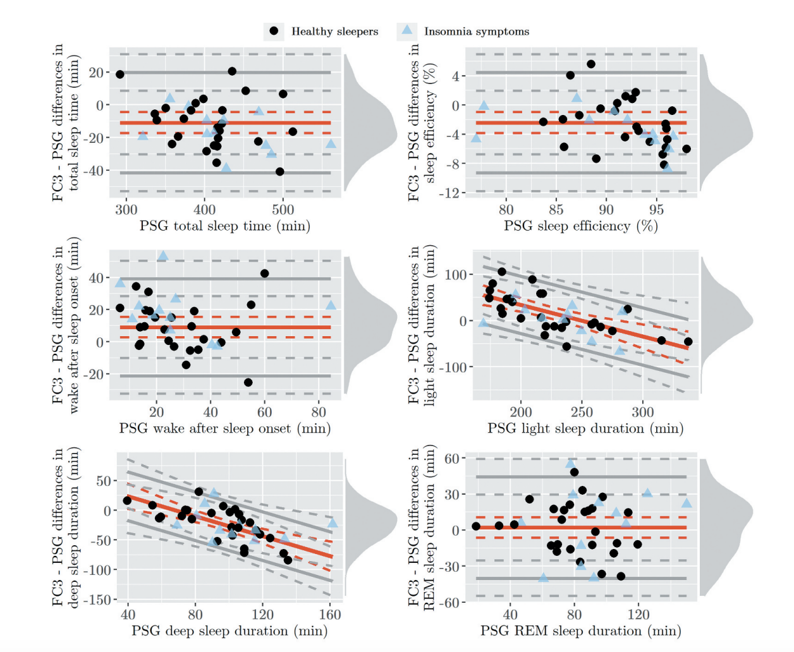
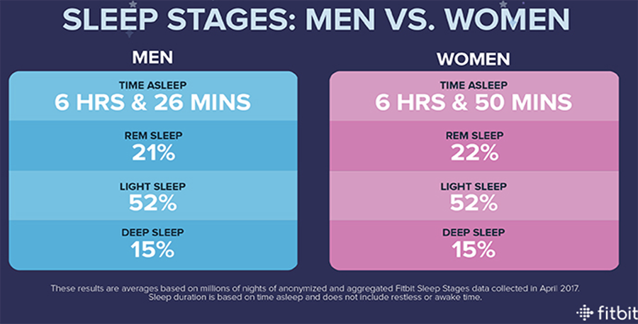
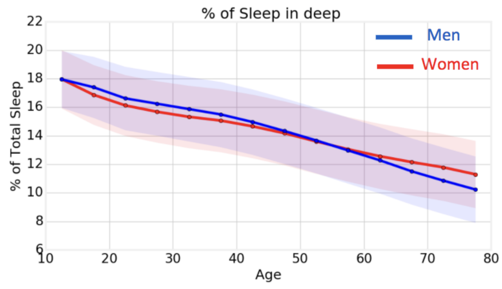
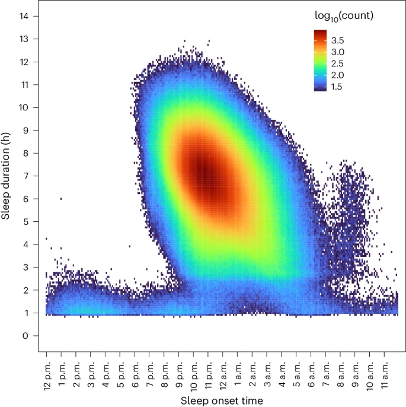
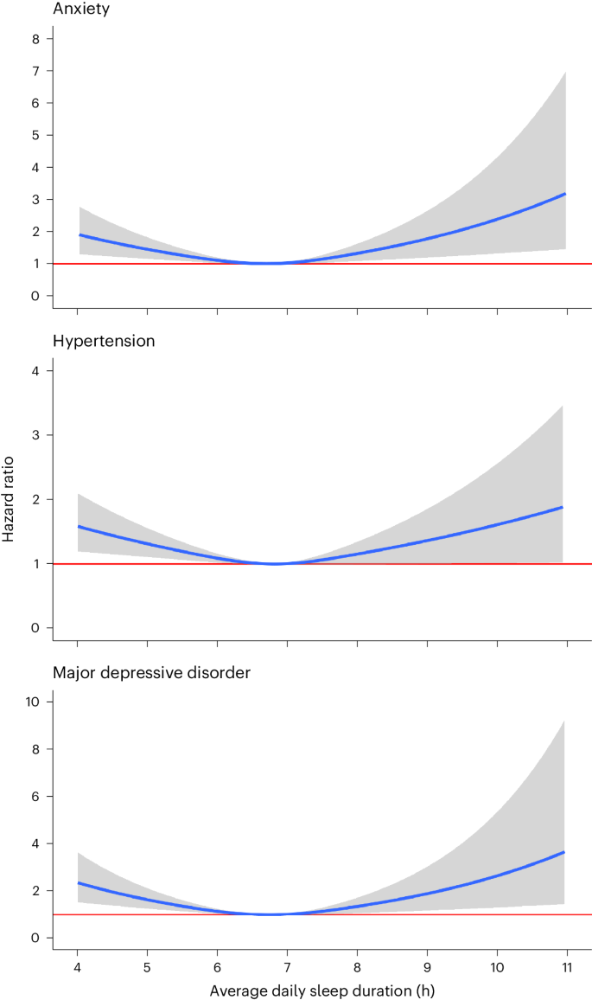
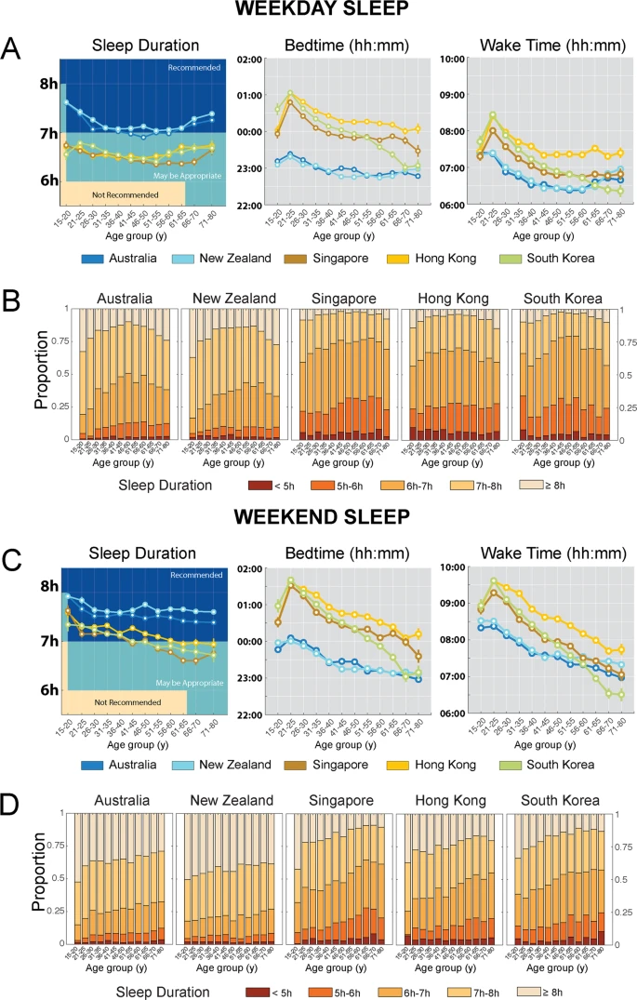
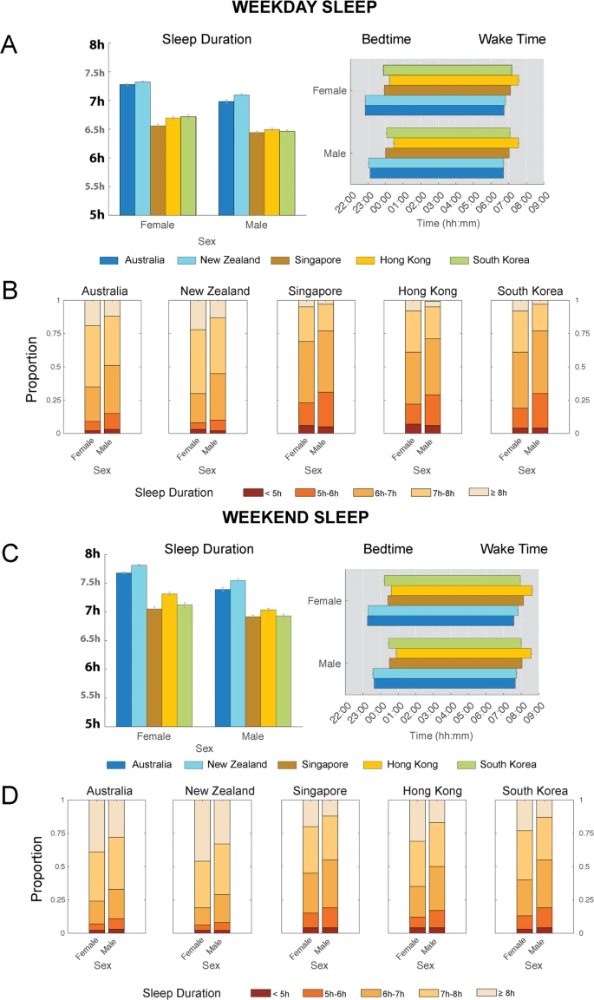
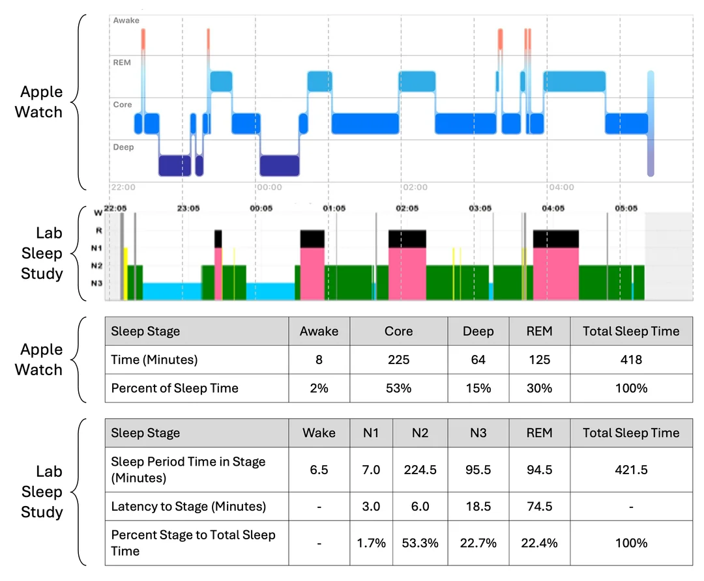

## Fitbit charge 3
[Performance of Fitbit Charge 3 against polysomnography in measuring sleep in adolescent boys and girls](https://www.tandfonline.com/doi/full/10.1080/07420528.2021.1903481)

## Fitbit

[Sleep patterns and risk of chronic disease as measured by long-term monitoring with commercial wearable devices in the All of Us Research Program](https://www.nature.com/articles/s41591-024-03155-8)

[Timing of Deep and REM Sleep Based on Fitbit Sleep Staging in Young Healthy Adults under Real-Life Conditions](https://www.mdpi.com/2076-3425/14/3/260)

[Large-scale data from wearables reveal regional disparities in sleep patterns that persist across age and sex](https://www.nature.com/articles/s41598-019-40156-x)

## Apple watch

[spectrophotometer](https://www.reddit.com/user/spectrophotometer/) posted on reddit [Apple Watch Sleep Tracking vs. Lab Sleep Study](https://www.reddit.com/r/AppleWatch/comments/1azsig3/apple_watch_sleep_tracking_vs_lab_sleep_study/?rdt=49029) the results from his sleep study with his apple watch

- very good overal correlation
- quasi perfect estimation of WASO and N1/2 (light sleep) phases
- slight underestimation of deep sleep
- slight overestimation of rem sleep

## Whoop

https://pubmed.ncbi.nlm.nih.gov/32713257/
