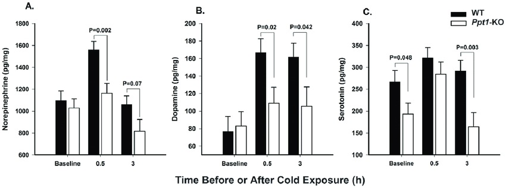
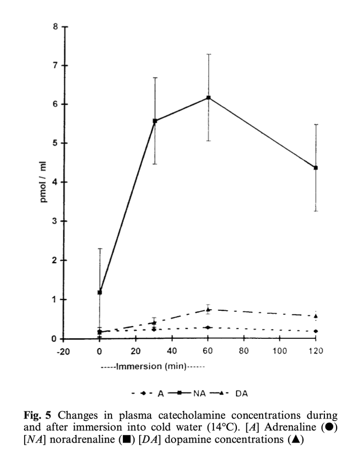

## Cognition

[The Effect of Cold Exposure on Cognitive Performance in Healthy Adults: A Systematic Review](https://pmc.ncbi.nlm.nih.gov/articles/PMC8470111/) find that the majority of the studies show that a single acute exposure to cold may impair attention, speed of processing, memory and executive function and these effects might depend on individual physiological responses to cold as well as the extent of the exposure in terms of duration and temperature reached.

## Catecholamines

[In a Model of Batten Disease, Palmitoyl Protein Thioesterase-1 Deficiency Is Associated with Brown Adipose Tissue and Thermoregulation Abnormalities](http://dx.doi.org/10.1371/journal.pone.0048733), ignoring the PPT1 knockout mice, gives the following result in mice of cold exposure on Norephinephrine & Dopamine

[Human physiological responses to immersion into water of different temperatures](https://pubmed.ncbi.nlm.nih.gov/10751106/)

## Short term metabolic benefits

## Long term thermogenic fat conversion

## Cold shock proteins

## Tumor growth
[Brown-fat-mediated tumour suppression by cold-altered global metabolism](https://www.nature.com/articles/s41586-022-05030-3)
