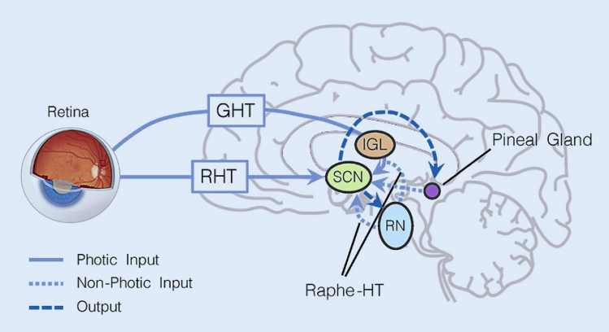

[Effects of light on human circadian rhythms, sleep and mood](https://link.springer.com/article/10.1007/s11818-019-00215-x)

Input and output pathways to/from the suprachiasmatic nuclei(SCN). The photic input pathways that relay information about the intensity and spectral composition of ambient light are the
retinohypothalamic tract (RHT) and the geniculohypothalamic tract (GHT), which connects retina and
SCN via the intergeniculate leaflet (IGL) in the thalamus.Additionally, the SCN also receive non-photic
information from the raphe nuclei (RN) via the raphe-hypothalamic tract (raphe-HT) and from the
pineal gland. Themainoutputisfrom theSCN to the serotonergic raphe nuclei(RN, receiveinformation
about the phase of the circadian clock and regulate vigilance state of the body) and the pineal gland,
where melatonin is produced. Input and output pathways form reciprocal loops

[Light therapies to improve sleep in intrinsic circadian rhythm sleep disorders and neuro-psychiatric illness: A systematic review and meta-analysis](https://www.sciencedirect.com/science/article/pii/S1087079218301886) All interventions increased light exposure in the morning, and three involved some instruction to avoid or reduce evening light exposure. This effect size can be translated to 25 min earlier sleep timing (using the pooled SD to convert overall SMD back into hours/minutes, whilst excluding SMD of the outlier in which sleep onset was 1.5 h earlier. Effects were homogeneous, with the exception of Langevin et al. which was an extreme outlier. This study was small (n = 10) with highly selective exclusion criteria compared to others, and used spectacle mounted LEDs rather than a light box, likely increasing ‘dose’ of light reaching the circadian photoreceptors

