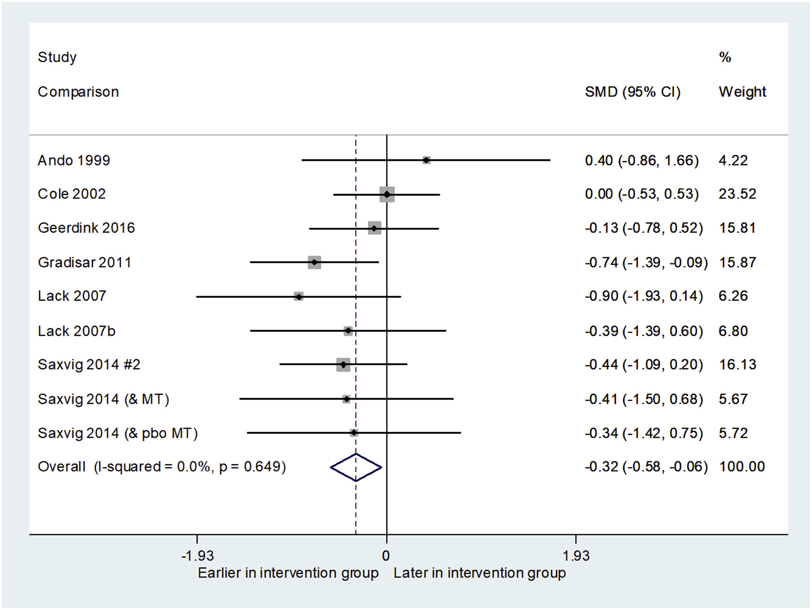

[Light therapies to improve sleep in intrinsic circadian rhythm sleep disorders and neuro-psychiatric illness: A systematic review and meta-analysis](https://www.sciencedirect.com/science/article/pii/S1087079218301886) All interventions increased light exposure in the morning, and three involved some instruction to avoid or reduce evening light exposure. This effect size can be translated to 25 min earlier sleep timing (using the pooled SD to convert overall SMD back into hours/minutes, whilst excluding SMD of the outlier in which sleep onset was 1.5 h earlier. Effects were homogeneous, with the exception of Langevin et al. which was an extreme outlier. This study was small (n = 10) with highly selective exclusion criteria compared to others, and used spectacle mounted LEDs rather than a light box, likely increasing ‘dose’ of light reaching the circadian photoreceptors

