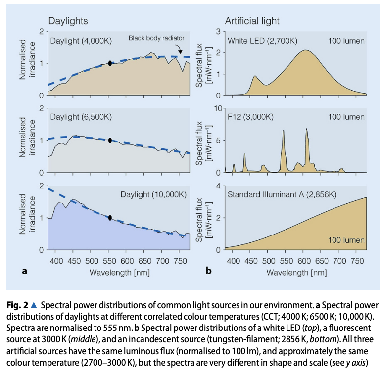
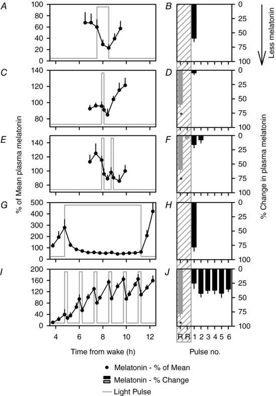

[Effects of light on human circadian rhythms, sleep and mood](https://link.springer.com/article/10.1007/s11818-019-00215-x)

[Functional decoupling of melatonin suppression and circadian phase resetting in humans](https://pmc.ncbi.nlm.nih.gov/articles/PMC5983136/)

