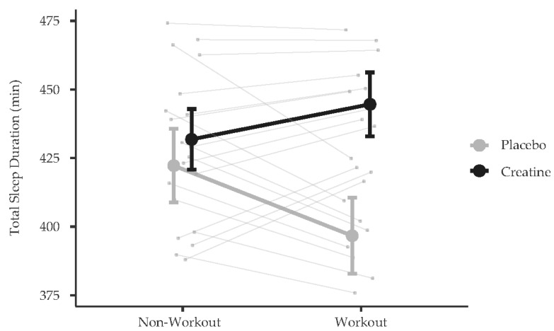

## Sleep

[Single dose creatine improves cognitive performance and induces changes in cerebral high energy phosphates during sleep deprivation](https://www.nature.com/articles/s41598-024-54249-9) at 0.35g/kg of creatine

[Creatine Improves Total Sleep Duration Following Resistance Training Days versus Non-Resistance Training Days among Naturally Menstruating Females](https://pubmed.ncbi.nlm.nih.gov/39203908/)

